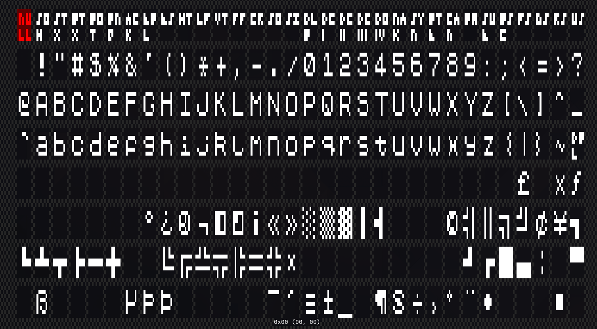
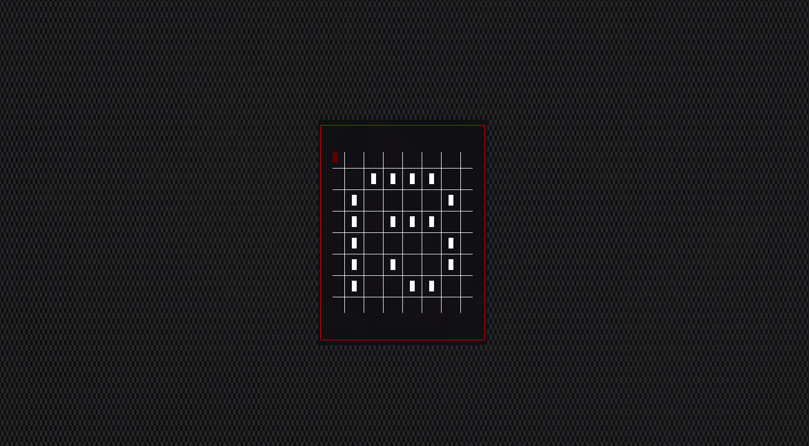
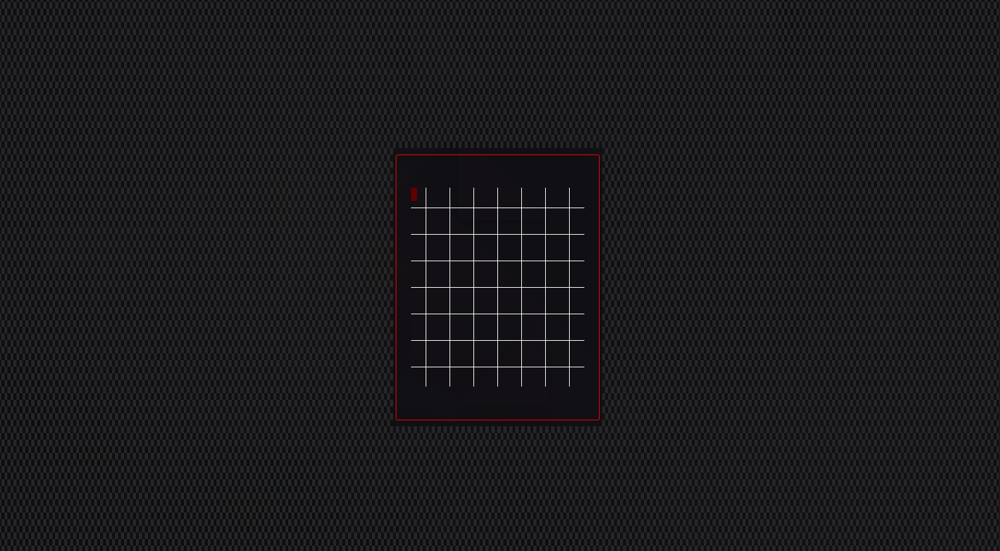

# Runesetter

A very simple TUI program for generating character sets. This was written for a GPU that I am helping build as a project at college.

The files this program produces is a 2kb binary file broken up into chunks of 8bytes. The output should be able to be directly put onto the character ROM.

## How to use:

### Running the program

* Run the program from a terminal. (If you are on Windows please use Windows Terminal if possible.)
* Use the flag `-p` to specify the path to the file you want to edit.
* If you want to convert an image file to a runeset specify the path to the image with `-i`and the path to the runeset file you want to create with `-p`[^1][^2]

### Keybindings

* Use `Up/Down/Left/Right` keys to move the cursor,
* Use `Enter/Space` to select a character or flip a bit,
* Use `Esc/Q` to quit or leave edit mode,
* Press `Backspace` to clear a character,
* Press `I` to invert a character,
* Press `F` to flip a character,
* Press `C/V` to copy/paste a character respectively,

## Screenshots:

[^1]: Note: if you specify an already existing file, the file will be overwritten.
[^2]: The files should be (256x64) `.png` file with a white (`0xFFFFFF`) background and black (`0x000000`) foreground. Other colours are ignored.
